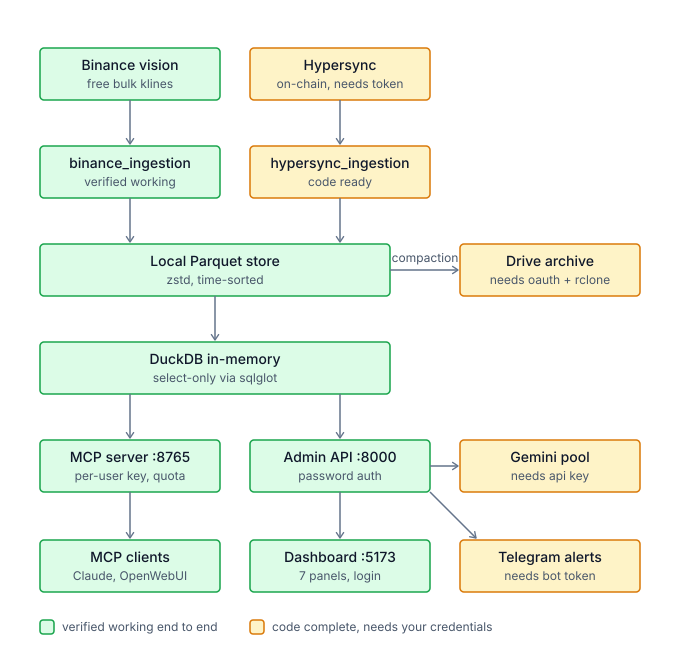

# ChainQuant Platform

Blockchain and exchange market-data platform for AI-assisted quant research.
Parquet on cheap storage, DuckDB for compute, exposed to LLM clients over MCP.

## Architecture



Green is verified working end to end; amber is code complete but waiting on
credentials. The left-hand chain (Binance -> Parquet -> DuckDB -> serving)
needs no credentials at all. The three amber services on the right are
optional attachments -- if any is unconfigured the main pipeline still runs,
it just skips archiving, AI diagnosis or alerting respectively.

Note the storage arrow direction: local Parquet feeds the Drive archive, not
the other way round. DuckDB only ever reads local disk.

## What actually works today

| Component | Status |
|---|---|
| Binance market-data ingestion (`data.binance.vision`) | Working — no API key needed |
| AWS Public Blockchain ingestion (BTC/ETH) | Working — no API key needed |
| DuckDB query engine over Parquet | Working |
| MCP server (HTTP, multi-user, quota + rate limited) | Working |
| Admin dashboard (7 panels, password login) | Working |
| Google Drive account pool + OAuth onboarding | Code complete, needs your OAuth client |
| Hypersync on-chain ingestion | Code complete, needs a free Envio token |
| Gemini AI diagnosis | Code complete, needs an API key |
| Rclone union storage + compaction daemon | Code complete, needs `rclone` + connected accounts |
| Strategy mining / backtest engine | **Not implemented** |

Panels report real state or say "not configured" — they never fabricate numbers.
Synthetic test fixtures are always labelled as such in the UI.

## Quick start

```bash
pip install -r backend/requirements.txt
npm install --prefix admin-dashboard

export QUANT_API_KEY=choose-a-password     # dashboard login + admin API auth
./start.sh
```

Then open http://localhost:5173 and log in with `QUANT_API_KEY`.

To get real data in immediately, use **Data Assets → Ingest market data**
(defaults to BTCUSDT 1m). No credentials required.

## Configuration

All optional except `QUANT_API_KEY`. Without a given key, the matching feature
reports itself as unconfigured rather than failing silently.

| Variable | Purpose |
|---|---|
| `QUANT_API_KEY` | Dashboard password and admin API key. **Unset = no auth.** |
| `HYPERSYNC_API_TOKEN` | On-chain ingestion — free at https://app.envio.dev/api-tokens |
| `GEMINI_API_KEY` / `GEMINI_API_KEYS` | AI diagnosis; comma-separate for key rotation |
| `TELEGRAM_BOT_TOKEN` / `TELEGRAM_CHAT_ID` | Alert delivery |
| `PUBLIC_BASE_URL` | Public origin, used to build the OAuth redirect URI |
| `RCLONE_UNION_REMOTE` | Upload target for compacted Parquet (default `gdrive_union:quant-data`) |
| `MCP_DEFAULT_DAILY_QUOTA` / `MCP_DEFAULT_RATE_PER_MIN` | Default per-user MCP limits |
| `MCP_QUERY_MEMORY_LIMIT` / `MCP_QUERY_TIMEOUT_S` / `MCP_MAX_RESULT_ROWS` | Per-query caps |

### Connecting Google Drive accounts

1. Create an OAuth client (**Web application**) in Google Cloud Console.
2. Add `http://localhost:8000/api/accounts/oauth/callback` as an authorized
   redirect URI (match `PUBLIC_BASE_URL` if deploying elsewhere).
3. Save the downloaded JSON to `backend/data/credentials.json`.
4. Dashboard → **Google Accounts → Add account**.

The retired `urn:ietf:wg:oauth:2.0:oob` flow is not used; a loopback redirect is.

## Serving MCP to users

The MCP server runs over HTTP so remote clients can reach it. Each user gets
their own key with a daily quota and per-minute rate limit; every call is
attributed in the audit log.

Issue keys in **MCP & Audit → Issue key**, then point a client at:

```
http://<host>:8765/mcp        header: X-API-Key: <user key>
```

Tools: `execute_quant_sql`, `list_tables`, `run_blockchain_backtest`,
`ingest_market_data`. Only read-only `SELECT` is accepted — validated with
sqlglot, and each query runs on its own cursor with memory and time caps.

Serving external users needs an always-on, publicly reachable host. A Mac at
home won't do it (sleep, dynamic IP, blocked inbound ports); a small VPS will.

## Architecture notes

**Don't query Parquet directly off a Google Drive mount.** Drive has no
reliable range-request support and aggressive rate limits, so DuckDB scans
degrade badly. Treat Drive as cold archive and keep the working set on local
NVMe. For bar-level backtesting that set is small — 10 years of 1-minute
klines for 1000 symbols is roughly 5–15 GB compressed.

Parquet files are written ZSTD-compressed and sorted by timestamp so DuckDB
can skip row groups on time-range scans.

## Layout

```
backend/
  api_server.py            admin API (auth, ingest, OAuth, DuckDB, alerts)
  mcp_server.py            multi-user MCP server
  mcp_users.py             per-user keys, quota, rate limiting
  duckdb_engine.py         view mounting + SQL safety
  binance_ingestion.py     free market-data ingestion
  hypersync_ingestion.py   on-chain ingestion
  google_account_manager.py, rclone_union_manager.py, data_compaction_watchdog.py
  quant_ai_bridge.py       Gemini key pool
  alerting.py, mcp_logs.py, sync_status.py, transfer_log.py
  tests/                   pytest suite
admin-dashboard/           React + Vite + Tailwind dashboard
vendor/                    vendored Drive-pooling projects (not yet integrated)
```

## Tests

```bash
python3 -m pytest backend/tests -q
```

## API integration reference

`docs/接入参考.md` records, per external service, the real endpoints, auth,
verified limits and the gotchas hit during integration (Google's retired OOB
OAuth flow, Binance's microsecond timestamps, the absence of any quota-query
endpoint on Gemini/Colab/Drive, and the measured 832 MB/day that makes full
chain mirroring impractical).

## Known gaps

- No strategy mining or backtest engine; the dashboard leaderboard is labelled
  as preview sample data.
- Colab dispatch still uses the polling worker. Google's official CLI can drive
  Colab directly, but free-tier eligibility is unverified — see docs/接入参考.md.
- `vendor/9drive` and `vendor/Drive-Pool` are vendored but not wired in.
- MCP user store is a JSON file — fine for tens of users, not thousands.
- Compaction upload path needs `rclone` on PATH; without it files stay local.
